# Hotel Boutique 360

## Presentación 

Sistema web para la gestión de habitaciones de un hotel boutique. La solución integra un frontend en React con autenticación OAuth 2.0/OpenID Connect mediante Amazon Cognito, un API Manager en AWS API Gateway, un microservicio backend en Spring Boot desplegado en Amazon EC2 y persistencia PostgreSQL administrada por Supabase.

La comunicación principal es:

```text
Usuario
  -> React + Vite
  -> Amazon Cognito (OAuth 2.0 / OIDC)
  -> AWS API Gateway (CORS + JWT Authorizer)
  -> Spring Boot en EC2
  -> Supabase PostgreSQL
```

## 1. Objetivo

Construir una aplicación cloud native funcional y segura que permita:

- Iniciar y cerrar sesión con Cognito.
- Obtener tokens mediante Authorization Code con PKCE.
- Leer los claims del token, incluyendo grupos o roles.
- Consultar el estado del backend mediante `/health`.
- Consultar y administrar habitaciones mediante el CRUD del backend.
- Proteger las operaciones administrativas con el rol `ADMIN`.
- Ejecutar el backend en EC2 mediante Docker y GitHub Actions.
- Persistir la información en Supabase PostgreSQL.

## 2. Tecnologías

### Frontend

- React 19.
- TypeScript.
- Vite.
- `react-oidc-context` y `oidc-client-ts` para OIDC.
- Axios para consumir el API Gateway.
- `lucide-react` para iconos.

### Backend

- Java 21.
- Spring Boot.
- Spring Security.
- OAuth2 Resource Server con JWT.
- Spring Data JPA.
- PostgreSQL mediante Supabase.
- Docker.

### Nube y entrega

- Amazon Cognito como proveedor de identidad.
- AWS API Gateway como API Manager.
- Amazon EC2 para ejecutar el backend.
- GitHub Container Registry para publicar la imagen Docker.
- GitHub Actions para compilar, publicar y desplegar.

## 3. Estructura del proyecto

```text
frontend-hotelboutique360/
  src/
    api/axiosInstance.ts       # Cliente Axios y header Authorization
    config/authConfig.ts       # Configuración OIDC y URL del API
    components/
      Navbar.tsx
      RoleGuard.tsx             # Protección visual por rol
      Sidebar.tsx
    views/
      DashboardView.tsx
      RoomsView.tsx             # CRUD conectado al backend
      ReservationsView.tsx
      Reportsview.tsx
    types/index.ts
    utils/authUtils.ts          # Lectura de grupos del JWT
  .env.local                   # No se versiona
  package.json

ms-hotel-rooms/
  src/main/java/
    .../controller/RoomController.java
    .../health/HealthCheckController.java
    .../config/SecurityConfig.java
    .../config/SecretGatewayFilter.java
    .../security/CognitoJwtAuthenticationConverter.java
  src/main/resources/application.properties
  Dockerfile
  .github/workflows/deploy.yml
```

## 4. Configuración de Cognito

Amazon Cognito administra el tenant de identidad, los usuarios, el inicio de sesión y los grupos utilizados como roles.

### 4.1 User Pool

El backend valida tokens emitidos por el User Pool configurado mediante su issuer:

```text
https://cognito-idp.<region>.amazonaws.com/<user-pool-id>
```

En el proyecto, este valor se configura en `VITE_COGNITO_AUTHORITY` para el frontend y en `spring.security.oauth2.resourceserver.jwt.issuer-uri` para Spring Boot.

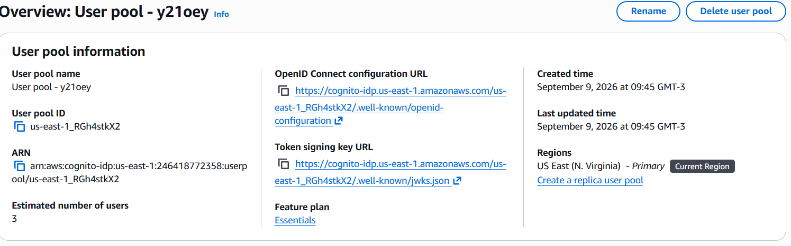

### 4.2 Usuarios y roles

| Usuario | Grupo Cognito | Propósito |
|---|---|---|
| Usuario administrador | `ADMIN` | Crear, editar y eliminar habitaciones |
| Usuario huésped o recepción | `HUESPED` o `RECEPCIONISTA` | Consultar el catálogo |

El grupo debe llamarse exactamente `ADMIN`, porque el backend lo transforma en la autoridad `ROLE_ADMIN`.

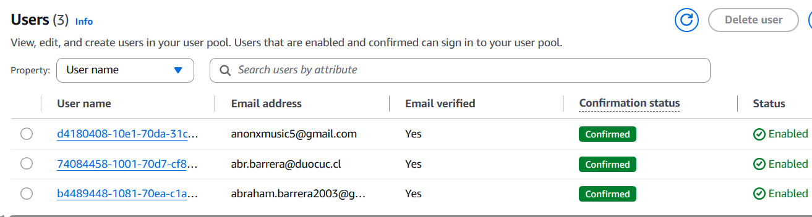
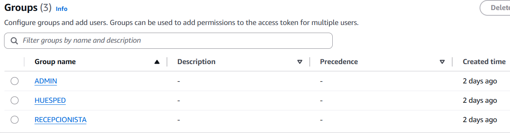
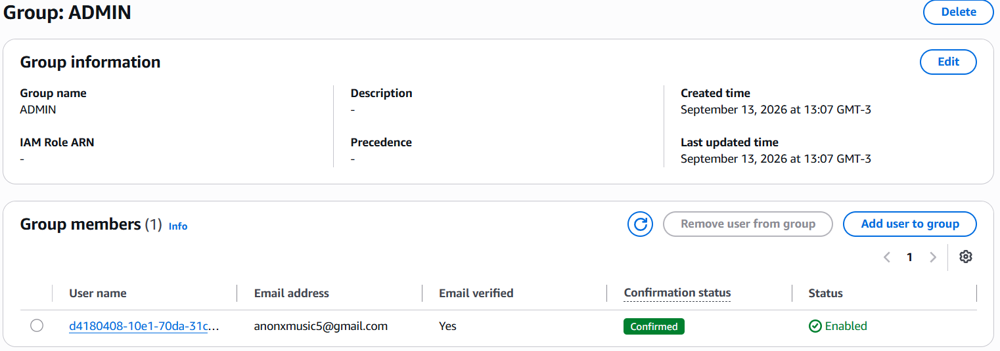

### 4.3 Aplicación SPA

Registrar una aplicación pública tipo SPA sin client secret para el frontend.

Configuración de prueba local:

```text
Callback URL:
http://localhost:5173
```

Scopes utilizados:

```text
openid
email
phone
```

Flujo OAuth:

```text
Authorization Code Grant con PKCE
```

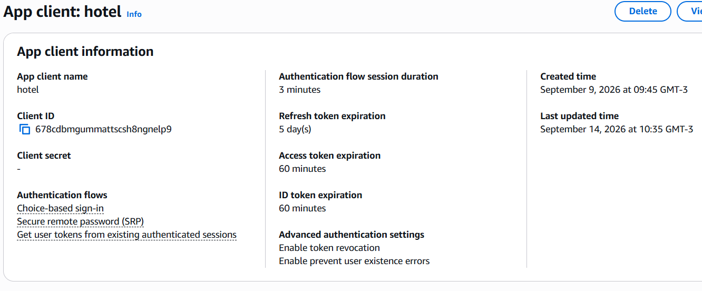
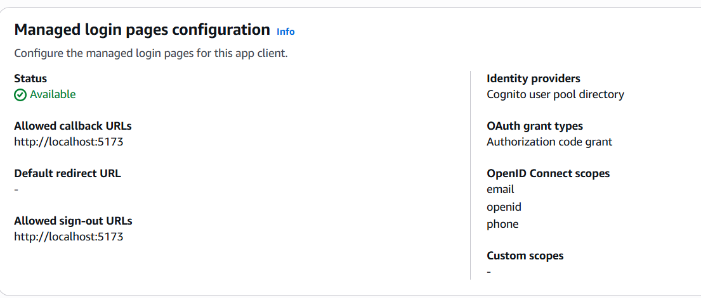

### 4.4 Configuración del frontend

Crear `.env.local` en desarrollo o configurar las variables equivalentes en el entorno de despliegue del frontend:

```env
VITE_COGNITO_AUTHORITY=https://cognito-idp.<region>.amazonaws.com/<user-pool-id>
VITE_COGNITO_CLIENT_ID=<app-client-id>
VITE_API_URL=https://<api-id>.execute-api.<region>.amazonaws.com
```

## 5. Implementación del frontend

### 5.1 Autenticación OIDC

`AuthProvider` envuelve la aplicación y administra:

- Redirección al login de Cognito.
- Recuperación del código de autorización.
- Intercambio mediante PKCE.
- Estado de autenticación.
- Cierre de sesión.
- Renovación y almacenamiento de la sesión OIDC.

La configuración utiliza:

```ts
response_type: 'code'
scope: 'openid email phone'
redirect_uri: window.location.origin
```

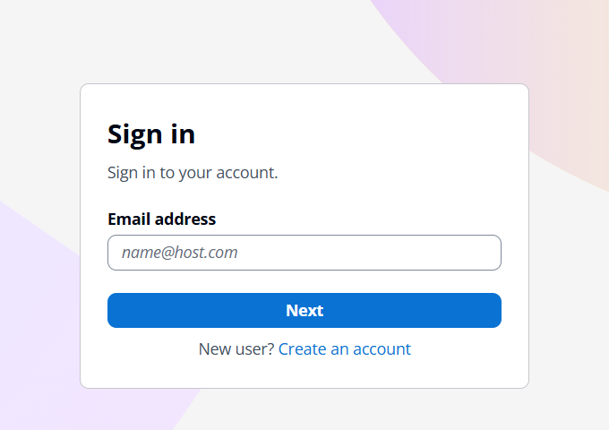

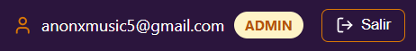

### 5.2 Claims y control por rol

El frontend lee el claim:

```text
cognito:groups
```

El componente `RoleGuard` limita visualmente el acceso a las vistas administrativas. Por ejemplo, la vista de reportes permite únicamente el grupo `ADMIN`.

Esta protección visual mejora la experiencia, pero la seguridad real también se aplica en Spring Security mediante `@PreAuthorize`.

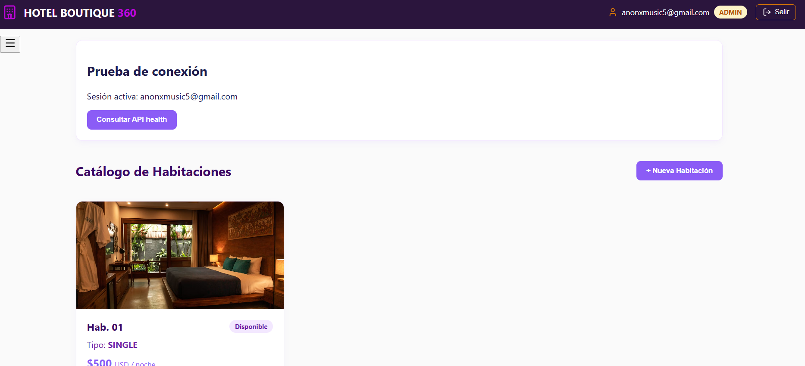

### 5.3 Header JWT

El cliente Axios agrega el token en las peticiones salientes:

```http
Authorization: Bearer <id_token>
```

El frontend nunca agrega el secreto `X-Secret-Gateway`. Ese secreto debe ser añadido internamente por API Gateway antes de llamar a EC2.

## 6. API Manager: AWS API Gateway

API Gateway funciona como intermediario entre el frontend y el backend.

### 6.1 Rutas

Las rutas que deben estar publicadas son:

| Método | Ruta API Gateway | Integración backend | Protección |
|---|---|---|---|
| GET | `/health` | `/api/health` | JWT según configuración |
| GET | `/api/v1/rooms` | `/api/v1/rooms` | Pública para catálogo |
| GET | `/api/v1/rooms/{id}` | `/api/v1/rooms/{id}` | Pública para catálogo |
| POST | `/api/v1/rooms` | `/api/v1/rooms` | JWT + `ADMIN` |
| PUT | `/api/v1/rooms/{id}` | `/api/v1/rooms/{id}` | JWT + `ADMIN` |
| DELETE | `/api/v1/rooms/{id}` | `/api/v1/rooms/{id}` | JWT + `ADMIN` |

La ruta `/health` del API Gateway puede mapearse al endpoint interno `/api/health` del backend.

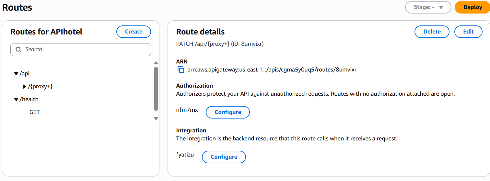

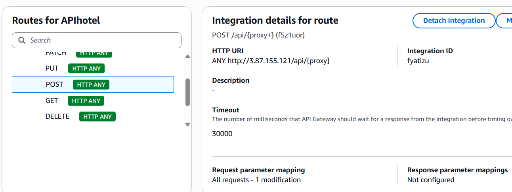

### 6.2 JWT Authorizer

El Authorizer debe validar como mínimo:

- `issuer` correspondiente al User Pool.
- Firma del JWT mediante las claves públicas de Cognito.
- Expiración del token.
- Tipo de token y claims requeridos.
- Audience o Client ID, según la configuración del API Gateway y el tipo de token utilizado.

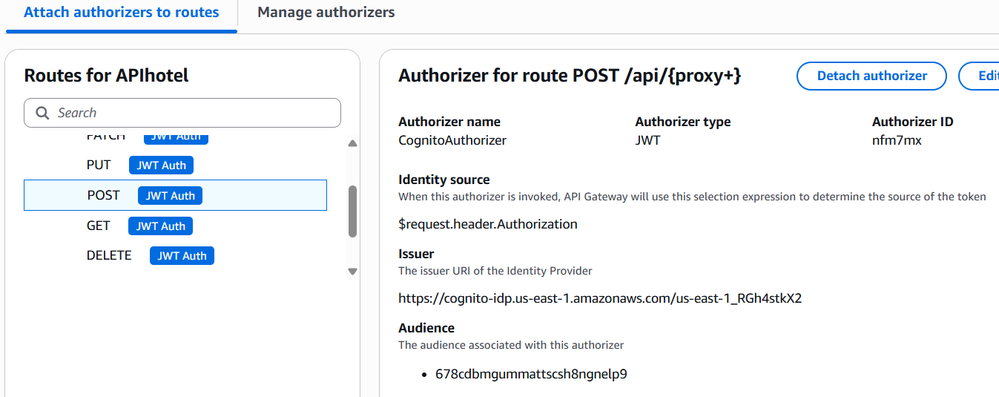

### 6.3 CORS

Para desarrollo local permitimos el origen real del frontend:

```text
http://localhost:5173
```

En producción se debe reemplazar por el dominio real del frontend. Configurar únicamente los métodos y headers necesarios:

```text
Métodos: GET, POST, PUT, DELETE, OPTIONS
Headers: Authorization, Content-Type
```

No se deben permitir orígenes arbitrarios con `*` cuando se presenta la configuración de producción.

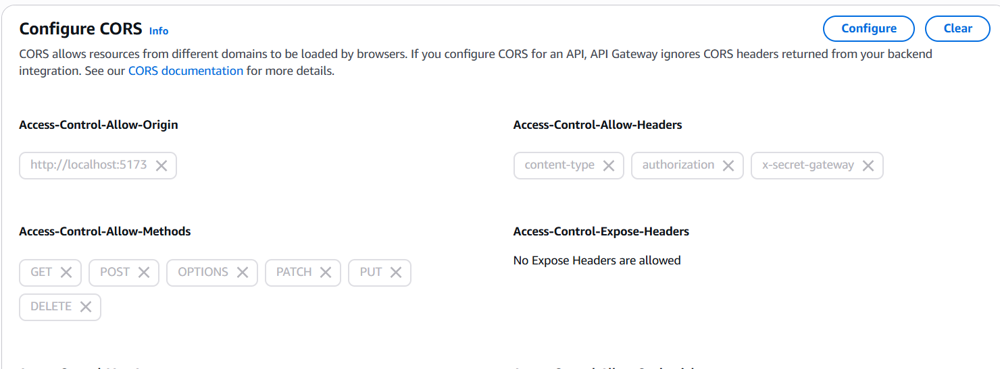

## 7. Backend Spring Boot en EC2

### 7.1 Seguridad

Spring Boot funciona como Resource Server OAuth2 y valida el JWT de Cognito. El conversor de autenticación lee `cognito:groups` y crea autoridades con el prefijo `ROLE_`.

Ejemplo:

```text
Grupo Cognito: ADMIN
Autoridad Spring: ROLE_ADMIN
Regla: hasRole('ADMIN')
```

Las operaciones administrativas del controlador de habitaciones están protegidas con:

```java
@PreAuthorize("hasRole('ADMIN')")
```

Además, el filtro `SecretGatewayFilter` exige el header interno:

```http
X-Secret-Gateway: <secreto configurado en GitHub Actions>
```

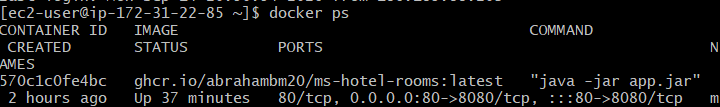
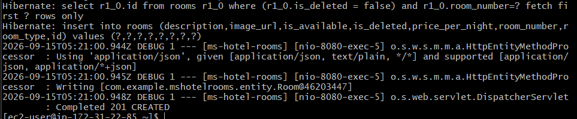

### 7.2 Persistencia

El backend utiliza entidades JPA, repositorios y PostgreSQL en Supabase. Las variables se inyectan desde GitHub Actions al contenedor:

```text
DB_URL
DB_USER
DB_PASSWORD
```

La base de datos contiene la entidad `Room`, con campos como:

- Identificador UUID.
- Número de habitación.
- Tipo.
- Precio por noche.
- Disponibilidad.
- Descripción.
- URL de imagen.

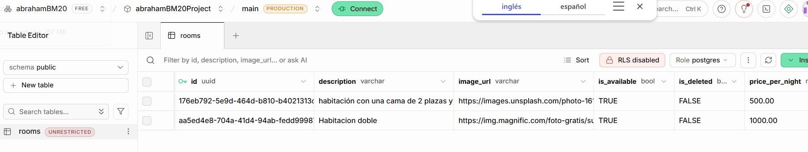

## 8. Despliegue mediante GitHub Actions

El workflow realiza estas etapas:

1. Descarga el código.
2. Configura Java 21.
3. Construye el JAR con Gradle.
4. Construye la imagen Docker.
5. Publica la imagen en GHCR.
6. Se conecta a EC2 mediante SSH.
7. Instala Docker si es necesario.
8. Descarga la imagen publicada.
9. Detiene y reemplaza el contenedor anterior.
10. Inyecta las variables de entorno.
11. Ejecuta el backend en el puerto interno `8080` y lo publica mediante el puerto `80`.

Secrets requeridos en GitHub:

```text
EC2_SSH_KEY
GH_CR_PAT
API_GATEWAY_SECRET
SUPABASE_DB_USER
SUPABASE_DB_PASSWORD
```

Variables de repositorio:

```text
TARGET_HOST_IP
```
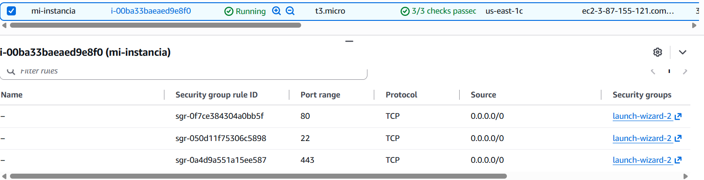

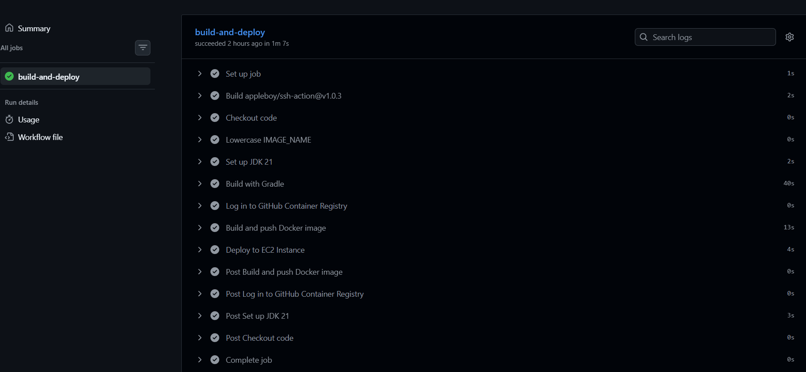
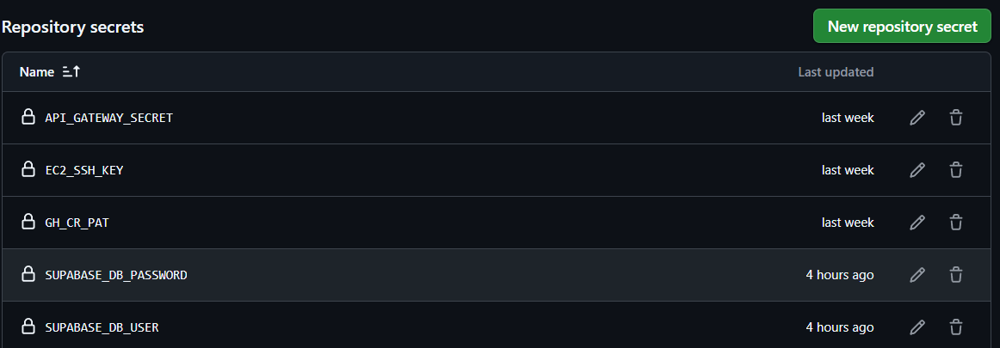
